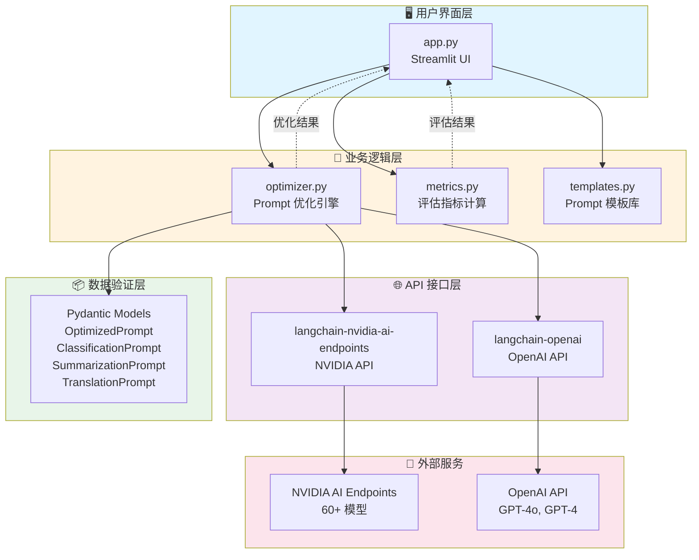
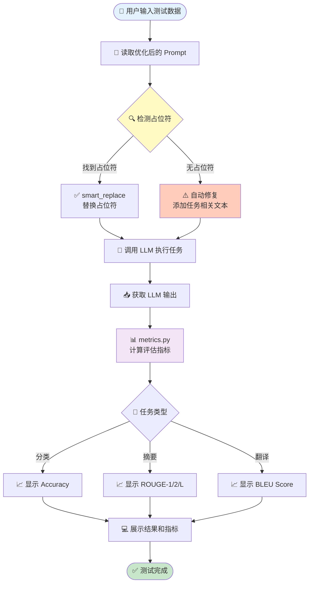
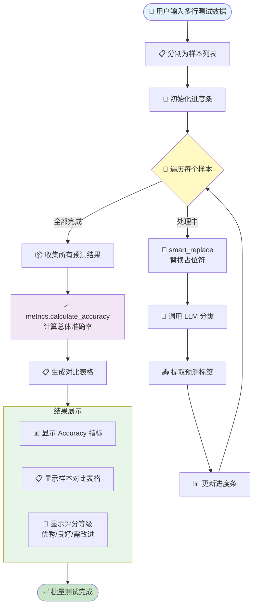
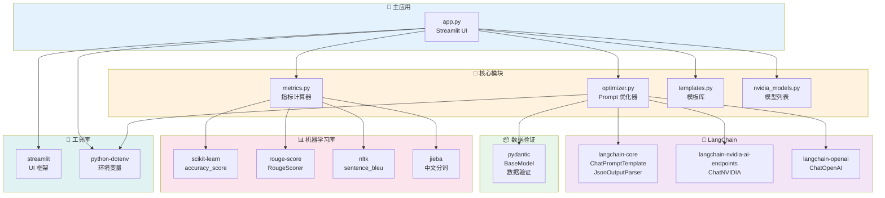
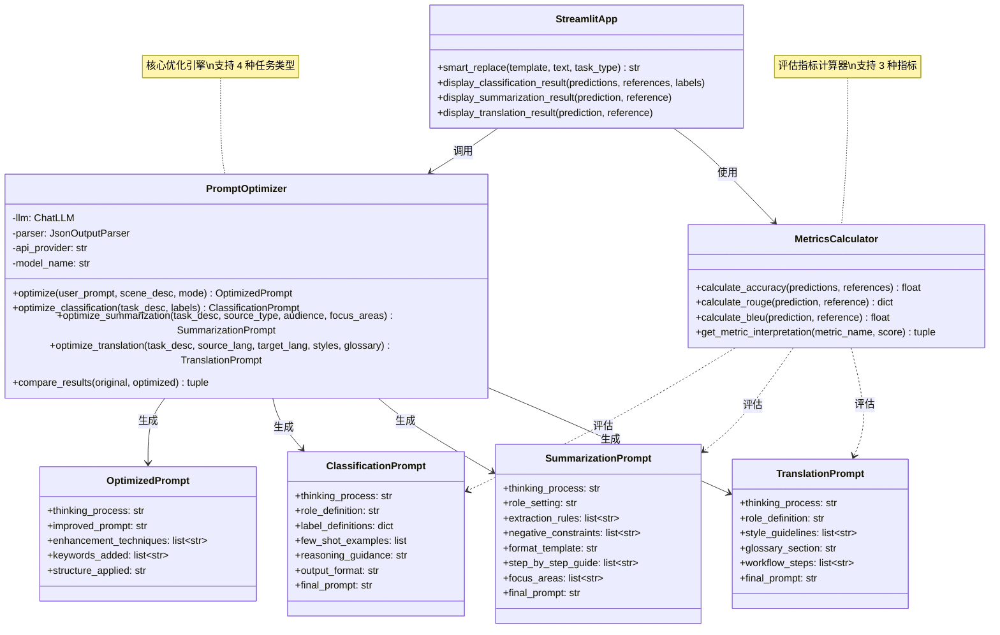
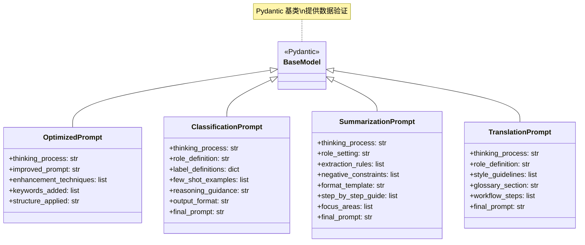

# PromptUp 项目架构文档

## 📐 架构概览

PromptUp 采用**模块化架构**设计，将 Prompt 优化、评估指标、用户界面三大核心功能解耦，便于维护和扩展。

### 架构图（UML）

#### 系统分层架构



---

## 📁 文件结构说明

### 核心文件

#### 1. `app.py` - Streamlit 主界面
**文件大小**：约 1437 行  
**作用**：用户交互界面，整合所有功能模块

**主要功能区块**：

| 代码区间 | 功能模块 | 说明 |
|---------|---------|------|
| 1-100 | 导入和初始化 | 导入依赖库，加载环境变量，初始化模型列表 |
| 100-250 | 侧边栏配置 | API 提供商选择、API Key 输入、模型选择、优化模式选择 |
| 250-400 | 任务类型选择器 | 4 个任务类型的 Tab（生成、分类、摘要、翻译） |
| 400-650 | 生成任务界面 | 通用 Prompt 优化输入和输出 |
| 650-800 | 分类任务界面 | 任务描述、标签输入、分类 Prompt 生成 |
| 800-900 | 摘要任务界面 | 任务描述、关注点输入、摘要 Prompt 生成 |
| 900-1000 | 翻译任务界面 | 源语言、目标语言、术语表输入、翻译 Prompt 生成 |
| 1000-1200 | 验证实验室 | 测试数据输入、参考答案输入、运行测试按钮 |
| 1200-1437 | 测试逻辑 | 单样本测试、批量测试、指标计算、结果展示 |

**关键函数**：

```python
def smart_replace(template: str, text: str, task_type: str) -> str:
    """
    智能占位符替换函数
    - 支持 30+ 种占位符格式
    - 自动检测占位符
    - 如果缺少占位符，自动添加
    行号：1082-1150
    """
    pass

def display_classification_result(predictions, references, labels):
    """
    显示分类任务测试结果
    - 计算 Accuracy
    - 展示混淆矩阵式对比表格
    - 显示评分解读
    行号：1260+
    """
    pass
```

**技术栈**：
- `streamlit`：UI 框架
- `st.session_state`：状态管理（存储优化结果）
- `st.tabs`：多任务类型切换
- `st.progress`：批量测试进度条

---

#### 2. `optimizer.py` - Prompt 优化核心引擎
**文件大小**：约 918 行  
**作用**：实现 Meta-Prompt 技术，针对不同任务类型优化 Prompt

**模块结构**：

| 代码区间 | 模块名称 | 说明 |
|---------|---------|------|
| 1-60 | 数据模型定义 | 4 个 Pydantic 模型（OptimizedPrompt、ClassificationPrompt、SummarizationPrompt、TranslationPrompt） |
| 60-200 | PromptOptimizer 类初始化 | API 配置、LLM 初始化、错误处理 |
| 200-350 | 分类任务优化 | `optimize_classification()` - 标签消歧、Few-Shot 合成、思维链设计 |
| 350-500 | 摘要任务优化 | `optimize_summarization()` - 角色设定、提取规则、格式模板 |
| 500-650 | 翻译任务优化 | `optimize_translation()` - 译者角色、风格指南、术语表整合 |
| 650-800 | 通用任务优化 | `optimize()` - 通用 Prompt 优化，支持多种框架 |
| 800-918 | 辅助函数 | A/B 对比测试、结果解析、错误处理 |

**关键类与方法**：

##### `PromptOptimizer` 类

```python
class PromptOptimizer:
    """
    Prompt 优化器核心类
    
    属性：
    - llm: LangChain LLM 实例（NVIDIA/OpenAI）
    - parser: JSON 输出解析器
    - api_provider: API 提供商类型
    
    方法：
    - optimize(): 通用 Prompt 优化
    - optimize_classification(): 分类任务专用优化
    - optimize_summarization(): 摘要任务专用优化
    - optimize_translation(): 翻译任务专用优化
    - compare_results(): A/B 对比测试
    """
```

##### 数据模型（Pydantic）

```python
class OptimizedPrompt(BaseModel):
    """通用优化结果"""
    thinking_process: str       # 优化思考过程
    improved_prompt: str        # 优化后的 Prompt
    enhancement_techniques: list[str]  # 使用的技术
    keywords_added: list[str]   # 新增的关键词
    structure_applied: str      # 应用的框架

class ClassificationPrompt(BaseModel):
    """分类任务优化结果"""
    thinking_process: str       # 优化思考过程
    role_definition: str        # 角色设定
    label_definitions: dict     # 标签定义字典
    few_shot_examples: list     # Few-Shot 示例
    reasoning_guidance: str     # 思维链引导
    output_format: str          # 输出格式说明
    final_prompt: str           # 最终 Prompt（含占位符）
    
class SummarizationPrompt(BaseModel):
    """摘要任务优化结果"""
    thinking_process: str       # 优化思考过程
    role_setting: str           # 角色设定
    extraction_rules: list[str] # 提取规则列表
    negative_constraints: list[str]  # 负面约束
    format_template: str        # 格式模板
    step_by_step_guide: list[str]    # 分步指导
    focus_areas: list[str]      # 关注领域
    final_prompt: str           # 最终 Prompt

class TranslationPrompt(BaseModel):
    """翻译任务优化结果"""
    thinking_process: str       # 优化思考过程
    role_definition: str        # 角色设定
    style_guidelines: list[str] # 风格指南列表
    glossary_section: str       # 术语表部分
    workflow_steps: list[str]   # 翻译流程步骤
    final_prompt: str           # 最终 Prompt
```

##### 核心方法详解

**1. 分类任务优化 (`optimize_classification`)**

```python
def optimize_classification(
    self, 
    task_description: str,  # 任务描述
    labels: list[str]       # 标签列表
) -> ClassificationPrompt:
    """
    分类任务专用优化方法
    
    优化策略：
    1. 标签消歧（Label Disambiguation）
       - 为每个标签生成明确定义
       - 说明边界情况和判断标准
       
    2. Few-Shot 合成
       - 根据标签自动生成 3-5 个典型示例
       - 覆盖不同标签，具有代表性
       
    3. 思维链设计（Chain of Thought）
       - 引导模型先分析特征，再给出结果
       - 使用 "Let's think step by step"
       
    4. 格式锁定（Output Format）
       - 明确要求输出格式（JSON/纯文本）
       - 禁止多余解释
       
    5. 占位符确保
       - 在 final_prompt 中强制包含占位符
       - 支持 [待分类文本]、{{text}} 等格式
    
    返回：ClassificationPrompt 对象
    """
    # 构建 Meta-Prompt（系统提示词）
    system_prompt = """
    你是专门构建 AI 文本分类器的专家...
    
    **必须在 final_prompt 中包含占位符**：
    - [待分类文本] 或 {{text}}
    - 明确标注待分类文本的插入位置
    """
    
    # 调用 LLM 生成优化结果
    # 解析 JSON 输出
    # 返回结构化结果
```

**2. 摘要任务优化 (`optimize_summarization`)**

```python
def optimize_summarization(
    self,
    task_description: str,   # 任务描述
    source_type: str,        # 源文本类型
    target_audience: str,    # 目标受众
    focus_areas: list[str]   # 核心关注点
) -> SummarizationPrompt:
    """
    摘要任务专用优化方法
    
    优化策略：
    1. 角色设定
       - 设计专业的摘要撰写者角色
       - 明确任务背景和目标
       
    2. 提取规则
       - 关键信息识别规则
       - 事实、数据、结论提取标准
       
    3. 负面约束
       - 避免主观评价
       - 不添加原文没有的信息
       - 禁止猜测和推断
       
    4. 格式模板
       - 提供结构化输出模板
       - 支持分段、要点、表格等格式
       
    5. 分步指导
       - 阅读理解 → 关键点识别 → 内容组织 → 摘要输出
    
    返回：SummarizationPrompt 对象
    """
```

**3. 翻译任务优化 (`optimize_translation`)**

```python
def optimize_translation(
    self,
    task_description: str,    # 任务描述
    source_lang: str,         # 源语言
    target_lang: str,         # 目标语言
    style_guidelines: list[str],  # 风格指南
    glossary: str = ""        # 术语表（可选）
) -> TranslationPrompt:
    """
    翻译任务专用优化方法
    
    优化策略：
    1. 专业角色设定
       - 设定为资深译者
       - 强调准确性和专业性
       
    2. 风格指南
       - 转换为清单形式
       - 明确翻译标准
       
    3. 术语表整合
       - 解析术语对（源词=目标词）
       - 格式化为表格或列表
       - 要求严格遵守术语翻译
       
    4. 三步翻译法
       - 第一步：直译（保证准确）
       - 第二步：意译（符合目标语言习惯）
       - 第三步：润色（提升流畅度）
    
    返回：TranslationPrompt 对象
    """
```

**技术要点**：

1. **Meta-Prompt 技术**
   - 使用 LLM 优化 Prompt 的技术（LLM-as-an-Optimizer）
   - 系统提示词（system_prompt）包含详细的优化指南
   - 要求 LLM 输出 JSON 格式的结构化结果

2. **占位符机制**
   - 在分类/摘要/翻译 Prompt 中强制要求包含占位符
   - 支持多种格式：`[待分类文本]`、`{{text}}`、`[输入评论]`
   - 确保生成的 Prompt 可以直接用于测试

3. **错误处理**
   - API 调用失败自动重试
   - JSON 解析失败回退到文本模式
   - 详细的错误日志输出

4. **API 适配**
   - 支持 NVIDIA 和 OpenAI 两种 API
   - 自动检测并适配 API 格式差异
   - 统一的错误处理机制

---

#### 3. `metrics.py` - 评估指标计算模块
**文件大小**：约 200+ 行  
**作用**：实现 Accuracy、ROUGE、BLEU 三大评估指标

**模块结构**：

| 代码区间 | 功能 | 说明 |
|---------|------|------|
| 1-50 | 导入和初始化 | 导入评估库，初始化分词器 |
| 50-100 | Accuracy 计算 | 分类任务准确率 |
| 100-150 | ROUGE 计算 | 摘要任务 ROUGE-1/2/L |
| 150-200 | BLEU 计算 | 翻译任务 BLEU Score |
| 200+ | 指标解读 | 根据分数返回评级和建议 |

**关键类与方法**：

```python
class MetricsCalculator:
    """
    评估指标计算器
    
    方法：
    - calculate_accuracy(): 计算分类准确率
    - calculate_rouge(): 计算 ROUGE-1/2/L
    - calculate_bleu(): 计算 BLEU Score
    - get_metric_interpretation(): 获取指标解读
    """
    
    def calculate_accuracy(
        self, 
        predictions: list[str],  # 预测结果列表
        references: list[str]    # 参考答案列表
    ) -> float:
        """
        计算分类任务准确率
        
        实现：
        - 使用 sklearn.metrics.accuracy_score
        - 返回 0-100 的百分比
        - 自动处理大小写和空格
        
        返回：Accuracy (0-100)
        """
        # 预处理：去除空格，统一大小写
        # 调用 sklearn 计算
        # 转换为百分比
        pass
    
    def calculate_rouge(
        self,
        prediction: str,    # LLM 生成的摘要
        reference: str      # 人工撰写的参考摘要
    ) -> dict:
        """
        计算 ROUGE 分数
        
        实现：
        - 使用 rouge_score 库
        - 计算 rouge1、rouge2、rougeL
        - 返回 F1 Score（0-100）
        
        返回：{"rouge1": 65.3, "rouge2": 42.1, "rougeL": 58.7}
        """
        # 初始化 ROUGE 计算器
        # 计算三种 ROUGE 分数
        # 提取 F1 Score 并转换为百分比
        pass
    
    def calculate_bleu(
        self,
        prediction: str,    # LLM 生成的译文
        reference: str      # 人工翻译的参考译文
    ) -> float:
        """
        计算 BLEU 分数
        
        实现：
        - 使用 nltk.translate.bleu_score
        - 支持中英文（中文使用 jieba 分词）
        - 返回 0-100 的分数
        
        返回：BLEU Score (0-100)
        """
        # 检测语言（中文/英文）
        # 中文使用 jieba 分词，英文使用空格分词
        # 调用 sentence_bleu 计算
        # 转换为百分比
        pass
    
    def get_metric_interpretation(
        self,
        metric_name: str,   # 指标名称（accuracy/rouge/bleu）
        score: float        # 分数（0-100）
    ) -> tuple[str, str, str]:
        """
        获取指标解读
        
        返回：
        - level: 评级（优秀/良好/需改进）
        - color: 颜色代码（green/yellow/red）
        - advice: 优化建议
        
        示例：
        ("优秀", "green", "Prompt 效果很好，继续保持！")
        """
        pass
```

**技术要点**：

1. **中文支持**
   - BLEU 计算使用 `jieba` 分词
   - 自动检测中文字符，选择合适的分词方法

2. **归一化处理**
   - 所有指标统一返回 0-100 的百分比
   - 便于统一展示和比较

3. **评分标准**
   - Accuracy: ≥80% 优秀，60-80% 良好，<60% 需改进
   - ROUGE: ≥50% 优秀，30-50% 良好，<30% 需改进
   - BLEU: ≥40% 优秀，20-40% 良好，<20% 需改进

---

#### 4. `templates.py` - Prompt 模板库
**文件大小**：约 150 行  
**作用**：提供经典 Prompt 工程框架模板

**包含的模板**：

| 模板名称 | 适用场景 | 核心要素 |
|---------|---------|---------|
| CO-STAR | 通用任务 | Context, Objective, Style, Tone, Audience, Response |
| BROKE | 业务分析 | Background, Role, Objective, Key Result, Evolve |
| CRISPE | 创意写作 | Capacity, Role, Insight, Statement, Personality, Experiment |
| RASCEF | 代码生成 | Role, Action, Steps, Context, Examples, Format |

**使用方式**：
```python
from templates import PROMPT_TEMPLATES

# 获取 CO-STAR 模板
template = PROMPT_TEMPLATES["CO-STAR"]
print(template["description"])  # 模板说明
print(template["structure"])     # 模板结构
```

---

#### 5. `nvidia_models.py` - NVIDIA 模型列表
**文件大小**：约 100 行  
**作用**：维护 NVIDIA AI Endpoints 支持的模型列表

**数据结构**：
```python
NVIDIA_MODELS = [
    "meta/llama-3.1-405b-instruct",    # 推荐：最强模型
    "meta/llama-3.1-70b-instruct",     # 平衡性能和速度
    "deepseek/deepseek-r1",            # 推理能力强
    "mistralai/mistral-large-2",       # 欧洲模型
    "qwen/qwen2.5-72b-instruct",       # 中文支持好
    # ... 共 60+ 个模型
]
```

---

### 辅助文件

#### 6. `test_nvidia.py` - API 连接测试脚本
**作用**：测试 NVIDIA API 配置是否正确

**功能**：
- 读取 `.env` 中的 API Key
- 调用 NVIDIA API 发送测试请求
- 显示连接状态和响应内容

**使用**：
```bash
python test_nvidia.py
```

---

#### 7. `test_optimize.py` - 优化功能测试脚本
**作用**：测试 Prompt 优化功能

**测试用例**：
- 通用 Prompt 优化
- 分类任务优化
- 摘要任务优化
- 翻译任务优化

**使用**：
```bash
python test_optimize.py
```

---

#### 8. `examples.py` - 使用示例脚本
**作用**：展示如何在代码中使用 PromptOptimizer

**示例代码**：
```python
from optimizer import PromptOptimizer

# 初始化优化器
optimizer = PromptOptimizer(
    api_provider="nvidia",
    model_name="meta/llama-3.1-405b-instruct"
)

# 优化分类 Prompt
result = optimizer.optimize_classification(
    task_description="对用户评论进行情感分类",
    labels=["积极", "消极", "中立"]
)

print(result.final_prompt)
```

---

#### 9. `requirements.txt` - 依赖包清单
**内容**：
```txt
streamlit>=1.31.0
langchain-core>=0.1.0
langchain-openai>=0.0.5
langchain-nvidia-ai-endpoints>=0.0.11
pydantic>=2.5.0
python-dotenv>=1.0.0
scikit-learn>=1.3.0
rouge-score>=0.1.2
nltk>=3.8
jieba>=0.42.1
```

---

#### 10. `.env.example` - 环境变量示例
**内容**：
```env
# API 提供商选择（nvidia 或 openai）
API_PROVIDER=nvidia

# NVIDIA API 配置
NVIDIA_API_KEY=nvapi-your-key-here
NVIDIA_BASE_URL=https://integrate.api.nvidia.com/v1

# OpenAI API 配置（可选）
OPENAI_API_KEY=sk-your-key-here
```

---

#### 11. `start.bat` - Windows 启动脚本
**内容**：
```batch
@echo off
echo 正在启动 PromptUp...
streamlit run app.py
pause
```

**使用**：双击 `start.bat` 即可启动应用。

---

## 🔄 数据流图

### 1. Prompt 优化流程

```mermaid
sequenceDiagram
    participant User as 👤 用户
    participant App as 🖥️ app.py
    participant Opt as 🧠 optimizer.py
    participant LLM as 🤖 LLM API
    participant State as 💾 session_state
    
    User->>App: 输入 Prompt 和任务类型
    App->>App: 选择优化模式
    App->>Opt: 调用优化方法<br/>(optimize_classification/summarization/translation)
    Opt->>Opt: 构建 Meta-Prompt<br/>(系统提示词)
    Opt->>LLM: 发送优化请求<br/>(NVIDIA/OpenAI API)
    LLM-->>Opt: 返回 JSON 结构化结果
    Opt->>Opt: 解析 JSON 输出<br/>(提取 final_prompt 等字段)
    Opt-->>App: 返回优化结果<br/>(ClassificationPrompt 等)
    App->>State: 存储优化结果
    App->>User: 展示优化后的 Prompt
    
    Note over User,State: 用户可进入验证实验室测试
```

### 2. 验证测试流程



### 3. 批量测试流程（分类任务）



---

## 🧩 模块依赖关系



---

## 🎨 UI 组件结构

### Streamlit 界面布局

```
侧边栏 (Sidebar)
├── API 提供商选择器 (selectbox)
├── API Key 输入框 (text_input)
├── 模型选择器 (selectbox)
└── 优化模式选择器 (radio)

主界面 (Main)
├── Tab 1: 生成任务
│   ├── 左栏：输入区
│   │   ├── Prompt 输入框
│   │   ├── 场景描述输入框
│   │   └── 优化按钮
│   └── 右栏：结果区
│       ├── 思考过程
│       ├── 优化后 Prompt
│       └── 优化技术列表
│
├── Tab 2: 分类任务
│   ├── 左栏：输入区
│   │   ├── 任务描述
│   │   ├── 标签列表
│   │   └── 生成按钮
│   └── 右栏：结果区
│       ├── 角色定义
│       ├── 标签定义
│       ├── Few-Shot 示例
│       └── 最终 Prompt
│
├── Tab 3: 摘要任务
│   └── （类似结构）
│
├── Tab 4: 翻译任务
│   └── （类似结构）
│
└── 验证实验室 (Expander)
    ├── 测试输入区 (text_area)
    ├── 参考答案区 (text_area)
    ├── 运行测试按钮
    └── 结果展示区
        ├── 评估指标卡片
        ├── 详细日志 (expander)
        └── 对比表格
```

---

## 🔐 环境变量管理

### 配置文件：`.env`

```env
# API 提供商
API_PROVIDER=nvidia  # 或 openai

# NVIDIA 配置
NVIDIA_API_KEY=nvapi-xxxxx
NVIDIA_BASE_URL=https://integrate.api.nvidia.com/v1

# OpenAI 配置
OPENAI_API_KEY=sk-xxxxx
```

### 读取方式

```python
from dotenv import load_dotenv
import os

load_dotenv()

api_provider = os.getenv("API_PROVIDER", "nvidia")
nvidia_key = os.getenv("NVIDIA_API_KEY")
openai_key = os.getenv("OPENAI_API_KEY")
```

### 优先级

1. **Streamlit 界面输入**：临时覆盖 `.env` 配置
2. **`.env` 文件**：持久化配置
3. **默认值**：`nvidia` 作为默认提供商

---

## 🚨 错误处理机制

### API 调用错误

```python
try:
    result = llm.invoke(prompt)
except Exception as e:
    if "authentication" in str(e).lower():
        return "❌ API Key 无效，请检查配置"
    elif "rate_limit" in str(e).lower():
        return "⏳ API 请求过于频繁，请稍后重试"
    else:
        return f"❌ API 调用失败：{e}"
```

### JSON 解析错误

```python
try:
    result = json.loads(llm_output)
except json.JSONDecodeError:
    # 回退到文本模式
    return {"final_prompt": llm_output}
```

### 占位符缺失错误

```python
if not has_placeholder(prompt):
    # 自动修复：添加占位符
    prompt += "\n\n待分类文本：{text}\n\n请输出分类结果。"
    logging.warning("⚠️ 自动修复：添加了占位符")
```

---

## 📊 性能优化策略

### 1. 批量处理优化
- 分类任务支持批量测试（一次输入多个样本）
- 使用进度条显示实时进度
- 避免重复加载模型

### 2. 缓存机制
```python
@st.cache_resource
def load_optimizer(api_provider, model_name):
    """缓存优化器实例，避免重复初始化"""
    return PromptOptimizer(api_provider, model_name)
```

### 3. 异步处理（未实现，可扩展）
```python
# 未来可以使用 asyncio 实现并行处理
async def batch_classify(samples):
    tasks = [classify_async(sample) for sample in samples]
    return await asyncio.gather(*tasks)
```

---

## 🧪 测试策略

### 单元测试（建议添加）

```python
# tests/test_optimizer.py
def test_classification_optimization():
    optimizer = PromptOptimizer("nvidia")
    result = optimizer.optimize_classification(
        task_description="情感分类",
        labels=["积极", "消极"]
    )
    assert "final_prompt" in result
    assert "[待分类文本]" in result.final_prompt or "{{text}}" in result.final_prompt
```

### 集成测试

```bash
# test_optimize.py
python test_optimize.py
```

### 手动测试

```bash
# 启动应用进行手动测试
streamlit run app.py
```

---

## 🔮 扩展方向

### 1. 新增任务类型
- 问答（Q&A）
- 对话（Conversation）
- 实体提取（Named Entity Recognition）

### 2. 更多评估指标
- F1 Score（分类任务）
- METEOR（翻译任务）
- BERTScore（语义相似度）

### 3. Prompt 版本管理
- 保存历史优化结果
- 比较不同版本的 Prompt
- 导出/导入 Prompt 模板

### 4. 批量任务支持
- 支持上传 CSV/Excel 文件
- 批量处理多个样本
- 导出结果报告

### 5. API 提供商扩展
- Anthropic Claude
- Google Gemini
- 本地部署模型（Ollama）

---

## 📚 参考资料

### Prompt Engineering 技术
- [CO-STAR Framework](https://www.promptingguide.ai/)
- [BROKE Framework](https://github.com/brexhq/prompt-engineering)
- [LangChain Documentation](https://python.langchain.com/)

### 评估指标
- [ROUGE Metric](https://github.com/google-research/google-research/tree/master/rouge)
- [BLEU Score](https://www.nltk.org/)
- [Accuracy in Classification](https://scikit-learn.org/)

### API 文档
- [NVIDIA AI Endpoints](https://build.nvidia.com/)
- [OpenAI API Reference](https://platform.openai.com/docs/)

---

## 🎓 设计模式

### 1. 策略模式（Strategy Pattern）
- 不同任务类型使用不同的优化策略
- `optimize()`, `optimize_classification()`, `optimize_summarization()`, `optimize_translation()`

### 2. 工厂模式（Factory Pattern）
- `PromptOptimizer` 根据 `api_provider` 创建不同的 LLM 实例

### 3. 模板方法模式（Template Method Pattern）
- `templates.py` 提供预定义的 Prompt 模板
- 各任务优化方法遵循统一的流程

### 4. 单例模式（Singleton Pattern）
- Streamlit 使用 `@st.cache_resource` 确保优化器实例唯一

---

## 📈 系统监控与日志

### 日志输出

```python
import logging

logging.basicConfig(level=logging.INFO)
logger = logging.getLogger(__name__)

# 示例日志
logger.info("✅ 找到占位符：[待分类文本]")
logger.warning("⚠️ 未找到占位符，自动修复")
logger.error("❌ API 调用失败")
```

### Streamlit 日志展示

```python
with st.expander("📝 详细日志", expanded=False):
    st.text(log_content)
```

---

## 🏗️ UML 类图

### 核心类关系图



### 数据模型继承关系



---

## 🎯 总结

PromptUp 采用**模块化、分层**的架构设计，具有以下优势：

1. **高内聚低耦合**：各模块职责明确，易于维护
2. **可扩展性强**：新增任务类型只需添加优化方法
3. **错误处理完善**：多层次的异常捕获和日志记录
4. **用户友好**：Streamlit 提供直观的图形界面
5. **评估体系完整**：支持三大主流评估指标

---

**如需更详细的架构说明或 UML 图，请参考以下资源**：
- 源代码注释
- 开发文档
- 技术博客

**如有疑问，请提交 Issue 或联系开发团队。**
